# Agent Architecture — Georgia CPA Accounting System

## Agent Interaction Diagram

```mermaid
graph TB
    subgraph "ORCHESTRATION LAYER"
        CEO["🎯 CEO ORCHESTRATOR<br/>CEO_ORCHESTRATOR.md<br/>━━━━━━━━━━━━━━━━━━<br/>Reads all coordination files<br/>Assigns tasks to terminals<br/>Detects conflicts & blockers<br/>Prints status dashboard"]
    end

    subgraph "COORDINATION FILES (Shared State)"
        CL["CLAUDE.md<br/>Master Context"]
        AL["AGENT_LOG.md<br/>Completion Log"]
        OI["OPEN_ISSUES.md<br/>Blockers & Flags"]
        WQ["WORK_QUEUE.md<br/>Task Queue + Deps"]
        AR["ARCHITECTURE.md<br/>Dependency Map"]
    end

    subgraph "RESEARCH LAYER (Run Once)"
        RA["📋 RESEARCH AGENT<br/>00_RESEARCH_AGENT.md<br/>━━━━━━━━━━━━━━━━━━<br/>Produces: Schema, Setup,<br/>Migration Spec, Work Queue,<br/>Architecture, Compliance Docs"]

        REV["🔍 REVIEW AGENT<br/>03_REVIEW_AGENT.md<br/>━━━━━━━━━━━━━━━━━━<br/>QA checks on Research<br/>Agent output before commit"]

        GTR["📊 GA TAX RESEARCH<br/>04_GEORGIA_TAX_RESEARCH.md<br/>━━━━━━━━━━━━━━━━━━<br/>DOR withholding tables<br/>SUTA rates, form specs<br/>Federal payroll rates"]

        QBR["📂 QB FORMAT RESEARCH<br/>05_QB_FORMAT_RESEARCH.md<br/>━━━━━━━━━━━━━━━━━━<br/>QBO CSV export formats<br/>Column mapping, client<br/>splitting logic, sample data"]
    end

    subgraph "MIGRATION LAYER (Run Once)"
        MA["🔄 MIGRATION AGENT<br/>01_MIGRATION_AGENT.md<br/>━━━━━━━━━━━━━━━━━━<br/>Validates QB CSVs<br/>Dry run → Confirm → Import<br/>Single transaction, rollback safe"]
    end

    subgraph "BUILD LAYER (Run Per Module)"
        subgraph "Phase 1: Foundation"
            F1["F1: DB Schema"]
            F2["F2: Chart of Accounts"]
            F3["F3: General Ledger"]
            F4["F4: Client Mgmt"]
            F5["F5: Auth/JWT"]
        end
        subgraph "Phase 2: Transactions"
            T1["T1: AP"]
            T2["T2: AR/Invoicing"]
            T3["T3: Bank Rec"]
            T4["T4: Approval Flow"]
        end
        subgraph "Phase 3: Documents"
            D1["D1: Upload"]
            D2["D2: Viewer"]
            D3["D3: Search"]
        end
        subgraph "Phase 4: Payroll"
            P1["P1: Employees"]
            P2["P2: GA Withholding"]
            P3["P3: GA SUTA"]
            P4["P4: Federal Tax"]
            P5["P5: Pay Stubs"]
            P6["P6: Payroll Gate"]
        end
        subgraph "Phase 5: Tax Forms"
            X1["X1: Form G-7"]
            X2["X2: Form 500"]
            X3["X3: Form 600"]
            X4["X4: Form ST-3"]
            X5["X5: Schedule C"]
            X6["X6: Form 1120-S"]
            X7["X7: Form 1120"]
            X8["X8: Form 1065"]
            X9["X9: Checklist Gen"]
        end
        subgraph "Phase 6: Reporting"
            R1["R1: P&L"]
            R2["R2: Balance Sheet"]
            R3["R3: Cash Flow"]
            R4["R4: PDF Export"]
            R5["R5: Dashboard"]
        end
        subgraph "Phase 7: Operations"
            O1["O1: Audit Viewer"]
            O2["O2: Backup"]
            O3["O3: Restore"]
            O4["O4: Health Check"]
        end
    end

    %% CEO reads all coordination files
    CEO -->|reads| CL
    CEO -->|reads/writes| AL
    CEO -->|reads/writes| OI
    CEO -->|reads/writes| WQ
    CEO -->|reads| AR

    %% Research Agent produces coordination files
    RA -->|produces| CL
    RA -->|produces| AL
    RA -->|produces| OI
    RA -->|produces| WQ
    RA -->|produces| AR

    %% Review Agent checks Research output
    RA -.->|output reviewed by| REV
    REV -->|flags issues in| OI

    %% Research agents feed into builders
    GTR -->|tax rates used by| P2
    GTR -->|tax rates used by| P3
    GTR -->|tax rates used by| P4
    GTR -->|form specs used by| X1
    GTR -->|form specs used by| X2
    GTR -->|form specs used by| X3
    GTR -->|form specs used by| X4
    QBR -->|formats used by| MA

    %% CEO assigns builder tasks
    CEO -->|assigns tasks to| F1
    CEO -->|assigns tasks to| T1
    CEO -->|assigns tasks to| P1
    CEO -->|assigns tasks to| X1
    CEO -->|assigns tasks to| R1
    CEO -->|assigns tasks to| O1

    %% All builders read/write coordination files
    F1 -->|updates| AL
    F1 -->|updates| OI

    %% Migration depends on research + foundation
    MA -->|depends on| F1
    MA -->|depends on| QBR

    %% Phase dependencies (simplified)
    F1 --> F2 --> F3
    F1 --> F4
    F1 --> F5
    F3 --> T1
    F3 --> T2
    T1 --> T3
    T2 --> T3
    F5 --> T4
    F4 --> D1 --> D2 --> D3
    F4 --> P1 --> P2 --> P5
    P1 --> P3
    P1 --> P4
    P2 --> P6
    P3 --> P6
    P4 --> P6
    P6 --> X1
    F3 --> X2
    F3 --> X3
    F3 --> X4
    F3 --> X5
    F3 --> X6
    F3 --> X7
    F3 --> X8
    F3 --> X9
    F3 --> R1
    F3 --> R2
    F3 --> R3
    R1 --> R4
    R2 --> R4
    R3 --> R4
    F4 --> R5
    F3 --> O1
    F1 --> O2 --> O3
    F1 --> O4

    %% Styling
    classDef orchestrator fill:#ff6b35,stroke:#333,color:#fff
    classDef research fill:#4ecdc4,stroke:#333,color:#fff
    classDef migration fill:#ffe66d,stroke:#333,color:#000
    classDef foundation fill:#95e1d3,stroke:#333,color:#000
    classDef transactions fill:#f38181,stroke:#333,color:#fff
    classDef documents fill:#aa96da,stroke:#333,color:#fff
    classDef payroll fill:#fcbad3,stroke:#333,color:#000
    classDef taxforms fill:#a8d8ea,stroke:#333,color:#000
    classDef reporting fill:#f9ed69,stroke:#333,color:#000
    classDef operations fill:#b8b5ff,stroke:#333,color:#000
    classDef coordination fill:#e8e8e8,stroke:#666,color:#333

    class CEO orchestrator
    class RA,REV,GTR,QBR research
    class MA migration
    class F1,F2,F3,F4,F5 foundation
    class T1,T2,T3,T4 transactions
    class D1,D2,D3 documents
    class P1,P2,P3,P4,P5,P6 payroll
    class X1,X2,X3,X4,X5,X6,X7,X8,X9 taxforms
    class R1,R2,R3,R4,R5 reporting
    class O1,O2,O3,O4 operations
    class CL,AL,OI,WQ,AR coordination
```



## How Agents Communicate

Agents do NOT communicate directly. They share state through **coordination files**:

| File | Written By | Read By | Purpose |
|------|-----------|---------|---------|
| `CLAUDE.md` | Research Agent (once) | All agents | Master rules, module checklist |
| `AGENT_LOG.md` | All agents | CEO + All agents | What's done, when, by whom |
| `OPEN_ISSUES.md` | All agents | CEO + All agents | Blockers, compliance flags, conflicts |
| `WORK_QUEUE.md` | Research Agent (once) | CEO + Builders | Task definitions + dependencies |
| `ARCHITECTURE.md` | Research Agent (once) | CEO + Builders | Module dependency map |

## Agent Execution Order

```
SESSION 1 (project init):
  Terminal 1: Research Agent (00)
  Terminal 2: Review Agent (03) — parallel QA
  Terminal 3: GA Tax Research (04) — parallel research
  Terminal 4: QB Format Research (05) — parallel research

SESSION 2+ (building):
  Terminal 1: CEO Orchestrator → tells you what to run
  Terminal 2: Builder Agent [assigned by CEO]
  Terminal 3: Builder Agent [assigned by CEO]

MIGRATION SESSION (one-time, after Phase 1 built):
  Terminal 1: Migration Agent (01) — requires CPA supervision
```

## Conflict Prevention Rules

1. **Two builders NEVER write to the same file** — CEO checks this
2. **Migration Agent runs ALONE** — no parallel builders during import
3. **Phase 0 tasks run SEQUENTIALLY** — data integrity critical
4. **Phase 1 must complete before Phase 2+** — everything depends on foundation
5. **Within a phase**, independent modules CAN run in parallel
